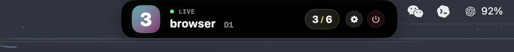

# yabai-space-marker

A compact macOS companion for `yabai` that keeps the current space visible in a native floating panel.

It can sit in the top notch area or at the bottom center of the current screen, follows the active display, and shows the focused space, display index, total space count, and sync/error state at a glance.

<p align="center">
  
</p>

## Highlights

- Native SwiftUI + AppKit macOS app
- Floating panel that follows the current screen
- Adjustable panel position: **Top** or **Bottom**
- Compact notch-style UI with animated space updates
- Shows the focused space title, display number, and total space count
- Built-in settings window for **Launch at login**, panel position, and quit
- Right-click menu with **Settings**, **Refresh**, and **Quit**
- Adaptive refresh scheduling to reduce idle CPU usage
- Command timeout protection for `yabai` queries
- Refresh automatically pauses while displays sleep and resumes on wake
- Error state stays compact instead of resizing the panel

## Requirements

You need a working `yabai` setup before running this app.

- macOS
- `yabai` installed
- `yabai -m query --spaces` works in Terminal
- Your `yabai` permissions and configuration already allow normal space queries

## How it works

The app reads live space data from the `yabai` CLI:

```bash
yabai -m query --spaces
```

It does **not** manage its own virtual-space state or rely on mock data. Instead, it continuously reflects the focused `yabai` space and refreshes more aggressively only when interaction or system events make it necessary.

Runtime behavior:

- adaptive refresh cadence for interactive vs idle states
- follow-up refresh after relevant events
- timeout protection around `yabai` subprocesses
- silent background refreshes during steady-state polling
- automatic pause/resume when displays sleep or wake

## Settings

The built-in settings window currently supports:

- **Launch at login**
- **Panel position**: Top / Bottom
- **Quit Space Marker**

The floating panel also includes inline controls for total space count, settings, and quit, plus a right-click context menu for quick actions.

## `yabai` executable lookup order

The app resolves `yabai` in this order:

1. `YABAI_BIN`
2. `yabai` found in the current `PATH`
3. fixed fallback paths:
   - `/opt/homebrew/bin/yabai`
   - `/opt/homebrew/sbin/yabai`
   - `/usr/local/bin/yabai`
   - `/usr/local/sbin/yabai`

If your install lives somewhere else, set it explicitly:

```bash
export YABAI_BIN="/your/path/to/yabai"
```

## Build and run

### Xcode

1. Open `yabai-space-marker.xcodeproj`
2. Select your signing team
3. Run the `yabai-space-marker` scheme

### Command line

```bash
DEVELOPER_DIR=/Applications/Xcode.app/Contents/Developer \
xcodebuild \
  -project yabai-space-marker.xcodeproj \
  -scheme yabai-space-marker \
  -configuration Debug \
  -derivedDataPath build-signed \
  build
```

Default app bundle path:

```text
build-signed/Build/Products/Debug/yabai-space-marker.app
```

## Project structure

```text
.
├── assets/
│   └── demo1.png
├── yabai-space-marker/
│   ├── ContentView.swift
│   ├── yabai_space_markerApp.swift
│   └── Assets.xcassets/
└── yabai-space-marker.xcodeproj/
```

### Key files

- `yabai-space-marker/ContentView.swift`
  - floating panel UI
  - notch-style surface and animation behavior
  - `YabaiSpacesMonitor` refresh logic
- `yabai-space-marker/yabai_space_markerApp.swift`
  - app entry point
  - `NSPanel` creation and placement
  - settings window and system integration

## Troubleshooting

### `yabai` could not be found

Check the following:

- `yabai -m query --spaces` works in Terminal
- `yabai` is in `PATH`, or `YABAI_BIN` is set
- your install path matches one of the supported lookup locations

### The panel appears, but space data does not update

This is usually a `yabai` configuration or permission issue. Confirm that:

- `yabai -m query --spaces` returns valid data
- your `yabai` setup is running normally
- your environment allows the app to execute the `yabai` binary

### Code signing fails during build

The project uses Xcode automatic signing by default. Select your own team in Xcode or adjust signing settings to match your local environment.

## Implementation notes

- Uses live `yabai` data only
- App Sandbox is disabled so the app can execute the external `yabai` binary
- Runs as an accessory app instead of a normal Dock app
