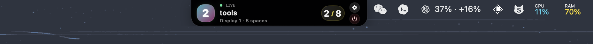

# yabai-space-marker

`yabai-space-marker` is a small macOS notch panel built with SwiftUI and AppKit. It stays attached to the physical top-center notch area of the current screen, floating above the menu bar, and shows the currently focused `yabai` space.

The UI uses a fixed native notch-style black shell with focused-space emphasis, numeric text transitions, a brief sticky liquid response, and a top-edge cyberpunk gradient line whenever the active space changes.

## Demo



## Features

- Fixed physical top-center notch panel on the current screen
- Shows only the active space number, label or `Space N`, display, and sync/error state
- Numeric transition for space number changes
- Sticky liquid stretch and top-edge cyan / magenta gradient line on space changes
- Compact native notch-style UI
- Fixed native notch-style appearance with a dedicated settings window for app controls
- Adaptive refresh scheduling to reduce idle CPU usage while keeping hover/manual updates responsive
- Command timeout protection for `yabai` queries/focus calls to avoid stuck subprocesses consuming resources
- Silent background refreshes to avoid unnecessary loading-state redraws during steady-state polling
- Refresh loop pauses automatically while displays are asleep and resumes on wake
- `yabai` subprocess timeout waiting uses event-driven completion instead of a spin/sleep polling loop
- Coalesced window/layout updates for smoother animations and less redundant work
- Inline total-space count, Settings, and Quit controls on the notch
- Right-click menu with Settings, Refresh, and Quit actions
- Built-in settings page for launch at login and quit

## How it works

The app does not manage spaces directly. It shells out to the `yabai` CLI:

- Query spaces: `yabai -m query --spaces`
- Focus a space: `yabai -m space --focus <index>`

The app refreshes space state with adaptive scheduling instead of a constant high-frequency polling loop. It uses a faster refresh cadence while the pointer is over the panel and adds timeout protection around `yabai` subprocesses so hung commands do not keep consuming resources.

When macOS reports an active-space change, or when a focus request completes, the app refreshes `yabai` state and updates the notch content to the actual focused space.

### Settings page

Open the app settings to configure:

- launch at login
- quit the app

## Requirements

You need a working `yabai` setup before running this app.

### Required

- macOS
- `yabai` installed
- `yabai` can run successfully from Terminal
- Your `yabai` configuration and permissions already allow querying spaces and focusing spaces

### `yabai` executable lookup order

The app resolves `yabai` in this order:

1. `YABAI_BIN`
2. `yabai` found in the current `PATH`
3. Fixed fallback paths:
   - `/opt/homebrew/bin/yabai`
   - `/opt/homebrew/sbin/yabai`
   - `/usr/local/bin/yabai`
   - `/usr/local/sbin/yabai`

If you installed `yabai` somewhere else, set the path explicitly:

```bash
export YABAI_BIN="/your/path/to/yabai"
```

## Build and run

### Xcode

1. Open `yabai-space-marker.xcodeproj`
2. Select your signing team
3. Run the `yabai-space-marker` scheme

### Command line

```bash
DEVELOPER_DIR=/Applications/Xcode.app/Contents/Developer \
xcodebuild \
  -project yabai-space-marker.xcodeproj \
  -scheme yabai-space-marker \
  -configuration Debug \
  -derivedDataPath build-signed \
  build
```

The default app bundle path is:

```text
build-signed/Build/Products/Debug/yabai-space-marker.app
```

## Project structure

```text
.
├── yabai-space-marker/
│   ├── ContentView.swift
│   ├── yabai_space_markerApp.swift
│   └── Assets.xcassets/
└── yabai-space-marker.xcodeproj/
```

### Key files

- `yabai-space-marker/ContentView.swift`
  - Notch panel UI
  - Native notch-style surface components
  - Space-change sticky liquid stretch and top-edge cyberpunk line animation
  - `YabaiSpacesMonitor` data and interaction logic

- `yabai-space-marker/yabai_space_markerApp.swift`
  - App entry point
  - `NSPanel` creation and layout
  - Fixed physical top-center panel placement when the screen or active space changes

## Appearance

The panel now uses a fixed native notch-style black shell so it stays visually consistent with the hardware cutout. The floating panel remains transparent around the shell and sits above the menu bar at the physical top center of the current display.

The separate settings window uses standard macOS materials for launch-at-login and app controls.

## UI model

The app uses one fixed notch panel. It does not show a space list or offer panel placement controls. The right side of the notch shows the total space count, Settings, and Quit controls; the right-click menu also provides Settings, Refresh, and Quit.

If `yabai` is unavailable or returns an error, the same compact notch shows an error state without resizing.

## Troubleshooting

### `yabai` could not be found

Check the following:

- `yabai -m query --spaces` works in Terminal
- `yabai` is in `PATH`, or `YABAI_BIN` is set
- Your install path is one of the supported lookup locations

### Spaces are visible, but switching fails

This is usually a `yabai` permissions or configuration issue, not a UI issue. Confirm that:

- `yabai -m space --focus <index>` works in Terminal
- Your `yabai` permissions, configuration, and scripting addition setup are correct for your environment

### Code signing fails during build

The project uses Xcode automatic signing by default. On your machine, select your own team in Xcode or adjust signing settings to match your local setup.

## Implementation notes

- Uses real `yabai` data only; there is no runtime mock path
- App Sandbox is disabled so the app can execute the external `yabai` binary
- Runs as an accessory app instead of a normal Dock app
